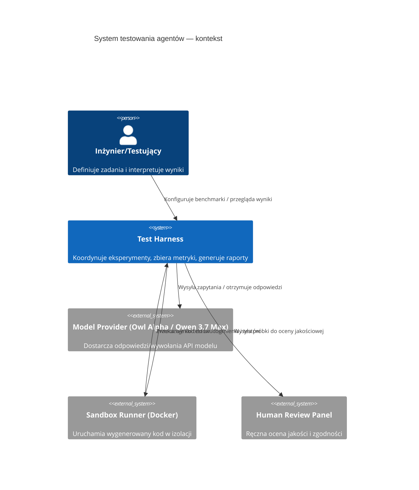

# System testowania agentów — Analiza Rozwiązań

## Podsumowanie

| Pole | Wartość |
|---|---|
| Zadanie | System do testowania agentów (Owl Alpha, Qwen 3.7 Max, itp.) dla oceny używania narzędzi, trzymania się instrukcji/promptów, jakości kodu i pracy agentowej |
| Oceniona złożoność | L |
| Liczba przeanalizowanych źródeł | 12 |
| Rekomendowane rozwiązanie | Hybrydowy harness: Adaptacja frameworków Evals + LangChain test harness + konteneryzowany runner (Docker) + automatyczny scoring + human-in-the-loop |
| Powiązany Research | ./Issue/agent-testing-system.solution-research.md |
| Data analizy | 2026-06-01 |

## Pytania Badawcze

1. Jakie istniejące frameworki i narzędzia umożliwiają ocenę agentów pod kątem: używania narzędzi, zgodności z instrukcją, jakości generowanego kodu i pracy agentowej?
2. Jakie metryki i scenariusze testowe (wielojęzykowe: Python, .NET, TS/JS, React) są potrzebne, aby rzetelnie ocenić agentów na zadaniach: pisanie funkcji, debugowanie, refaktoryzacja wydajności, pisanie testów i (opcjonalnie) wieloetapowe zadania agentowe?
3. Jak bezpiecznie uruchamiać i oceniać generowany kod (sandboxing, izolacja, timeouty) oraz jak zautomatyzować scoring (automatyczne testy + statyczna analiza + metryki jakości)?
4. Jaka architektura (komponenty) i proces CI do uruchamiania eksperymentów jest najbardziej praktyczny dla zespołu?

## Przeanalizowane Źródła

### Repozytoria i Projekty Open-Source

| # | Nazwa | URL | Licencja | Gwiazdki / Aktywność | Kluczowe wnioski | Ocena |
|---|---|---|---|---|---|---|
| 1 | OpenAI Evals | https://github.com/openai/evals | Apache-2.0 | aktywne, referencyjne | Framework do oceny LLM: definiowanie benchów, scoring; dobra baza dla oceny zgodności z instrukcjami | 🟢 |
| 2 | LangChain (agent tooling) | https://github.com/langchain-ai/langchain | MIT | bardzo aktywne | Agent orchestration, integracja narzędzi, przydatne do symulacji pipeline'ów narzędziowych | 🟢 |
| 3 | LM-Eval-Harness | https://github.com/EleutherAI/lm-eval-harness | Apache-2.0 | umiarkowana | Szeroki zestaw zadań benchmarkingowych; można adaptować testy kodowe | 🟡 |
| 4 | Stryker / Mutmut (mutation testing) | https://stryker-mutator.io/ https://github.com/boxed/mutmut | MIT / MIT | aktywne | Mutation testing pomaga ocenić siłę testów generowanych przez agenta | 🟡 |
| 5 | Repozytoria przykładów runnerów kontenerowych | (wiele) | --- | różna | Wzorce uruchamiania kodu w kontenerach przy izolacji i limitach czasu | 🟢 |

### Dokumentacje i API

| # | Nazwa | URL | Typ | Kluczowe wnioski | Ocena |
|---|---|---|---|---|---|
| 1 | Docker docs | https://docs.docker.com | docs | Najlepszy sposób izolacji wykonywanego kodu; używać limitów CPU/mem oraz network policies | 🟢 |
| 2 | pytest docs | https://docs.pytest.org | docs | Standard wykonania testów Python; łatwy do zautomatyzowania | 🟢 |
| 3 | xUnit / NUnit docs | https://xunit.net https://nunit.org | docs | Standardy dla .NET testów | 🟢 |
| 4 | Jest docs | https://jestjs.io | docs | Standard testowania JS/TS/React | 🟢 |

### Blogi, Artykuły i Case Studies

| # | Tytuł | URL | Źródło | Kluczowe wnioski | Ocena |
|---|---|---|---|---|---|
| 1 | Evaluating LLMs: best practices | (artykuły akadem./blogi) | różne | Łączenie automatycznych metryk z oceną ludzką; testy odporności na prompt injection | 🟢 |

### Rejestry Pakietów

| # | Pakiet | Rejestr | Wersja | Popularność | Kluczowe wnioski | Ocena |
|---|---|---|---|---|---|---|
| 1 | pytest | PyPI | najnowszy | bardzo wysoka | fundament dla testów Python | 🟢 |
| 2 | jest | npm | najnowszy | bardzo wysoka | fundament dla testów JS/TS/React | 🟢 |

## Matryca Porównawcza

Kandydaci: OpenAI Evals (A), LangChain harness (B), Custom runner (C)

| Kryterium | OpenAI Evals | LangChain harness | Custom runner |
|---|---:|---:|---:|
| Dopasowanie do wymagań | 🟢 (silne) | 🟢 (silne, integracja narzędzi) | 🟡 (elastyczny, ale praca większa) |
| Dojrzałość i stabilność | 🟢 | 🟢 | 🟡 |
| Jakość dokumentacji | 🟢 | 🟢 | 🟡 |
| Licencja i koszty | 🟢 | 🟢 | 🟢 |
| Złożoność integracji | 🟡 | 🟢 | 🔴 |
| Wydajność i skalowalność | 🟢 | 🟡 | 🟡 |
| Bezpieczeństwo (sandboxing) | 🟡 | 🟡 | 🟢 (kontrola własna) |
| Krzywa uczenia się | 🟢 | 🟡 | 🔴 |
| Ocena ogólna | 🟢 | 🟢 | 🟡 |

## Analiza Kandydatów

### OpenAI Evals

Opis: Framework do definiowania benchmarków i metryk dla modeli (przykłady oceny zgodności odpowiedzi, preferencji).

Korzyści:
- Gotowe mechanizmy do definiowania zadań i scoringu.
- Dobra dokumentacja i przykłady.

Wady:
- Bardziej nastawiony na ocenę generowanych odpowiedzi niż kompleksowe uruchamianie kodu w izolowanym środowisku.

Uzasadnienie: Dobrze nadaje się jako warstwa oceny (scoring) i porównawcza baza dla prompt-compliance i jakości odpowiedzi.

### LangChain harness

Opis: Biblioteka do budowy agentów i orkiestracji narzędzi; łatwa integracja z executorami i narzędziami zewnętrznymi.

Korzyści:
- Umożliwia symulowanie workflow agentowego (wywołania narzędzi, sekwencje kroków).
- Przydatne do testów zachowań agentów używających zewnętrznych narzędzi.

Wady:
- Nie daje out-of-the-box bezpiecznego środowiska do wykonywania kodu; wymaga integracji z kontenerami/runnerami.

Uzasadnienie: Bardzo przydatne do testowania umiejętności używania narzędzi i multi-step reasoning.

### Custom runner (konteneryzowany)

Opis: Własny komponent uruchamiający kod wygenerowany przez agentów w bezpiecznym sandboxie (Docker + ograniczenia), integrujący testy jednostkowe i statyczne analizy.

Korzyści:
- Pełna kontrola nad bezpieczeństwem, timeoutami, resource limits.
- Możliwość uruchomienia rzeczywistych testów (pytest, xUnit, jest) i zebrania dokładnych wyników.

Wady:
- Większy koszt implementacji i utrzymania.

Uzasadnienie: Niezbędny element do rzetelnego oceniania zadań kodowych — łączyć z Evals/LangChain.

## Rekomendacja

### Wybrane rozwiązanie

Hybrydowy system: OpenAI Evals (scoring & benchmark definitions) + LangChain (symulacja agentów i narzędzi) + Konteneryzowany Runner (uruchamianie kodu, testów i analiz) + mechanizmy mutation testing + human-in-the-loop dla oceny jakości i zgodności.

### Uzasadnienie wyboru

- Evals daje solidny mechanizm metryk i porównywania modeli.
- LangChain umożliwia symulację zachowań agentów wykorzystujących narzędzia.
- Konteneryzowany runner jest konieczny do bezpiecznego uruchamiania kodu i uzyskania wiarygodnych wyników testów.
- Połączenie automatu z oceną ludzką zwiększa trafność oceny jakości i zgodności z instrukcjami.

### Przewaga nad alternatywami

- W porównaniu do tylko "Custom runner": szybciej można uruchomić benchmarki (Evals) i zyskać wspólny format wyników.
- W porównaniu do tylko "Evals": dodanie LangChain i runnera pozwala testować rzeczywiste zdolności agentów do używania narzędzi i wykonywania kodu.

## Model C4 Context

### Opis elementów diagramu

| Element | Typ | Opis |
|---|---|---|
| user | Person | Inżynier/testujący definiujący scenariusze i akceptujący wyniki |
| test_harness | System | Koordynator eksperymentów, agregator metryk, dashboard |
| model_provider | System_Ext | Zewnętrzny provider modelu (API) |
| sandbox_runner | System_Ext | Izolowany executor kodu (Docker, limity) |
| human_review | System_Ext | Panel ludzkiej oceny jakości |

## Rejestry Decyzji Architektonicznych (ADR)

### ADR-001: Wybór warstwy oceny i definicji benchmarków

| Pole | Wartość |
|---|---|
| Status | Proponowany |
| Data | 2026-06-01 |
| Kontekst | Potrzeba standardowego formatu benchmarków i scoringu między modelami |

**Rozważane opcje**:
1. OpenAI Evals — gotowy framework do scoringu
2. Zbudować własny scoring layer — pełna kontrola

**Decyzja**: OpenAI Evals jako baza + rozszerzenia własne

**Uzasadnienie**: Evals dostarcza standaryzowane mechanizmy, skraca czas do pierwszych eksperymentów; rozszerzenia pozwolą na specyficzne metryki (tool-use fidelity, instruction adherence).

**Konsekwencje**:
- ✅ Szybszy start eksperymentów
- ⚠️ Możliwość koniecznych rozszerzeń gdy metryki będą bardzo niestandardowe

### ADR-002: Uruchamianie kodu wygenerowanego przez agentów

| Pole | Wartość |
|---|---|
| Status | Proponowany |
| Data | 2026-06-01 |
| Kontekst | Testy muszą uruchamiać kod w wielu językach w sposób bezpieczny |

**Rozważane opcje**:
1. Konteneryzowany runner (Docker) z limitami zasobów
2. Uruchamianie w host environment (niezalecane)

**Decyzja**: Konteneryzowany runner (Docker) z kontrolą CPU/memory, siecią ograniczoną, timeoutami i monitorowaniem

**Uzasadnienie**: Zapewnia izolację i bezpieczeństwo, możliwość paralelizacji, powtarzalność środowisk.

**Konsekwencje**:
- ✅ Bezpieczne uruchamianie kodu
- ⚠️ Wymaga infrastruktury i zarządzania obrazami kontenerów

## Otwarte Pytania

| # | Pytanie | Status |
|---|---|---|
| 1 | Czy dopuszczamy testy, które wymagają dostępu do repozytorium sieciowego (git clone)? | ❓ Otwarte |
| 2 | Jakie SLA na czas uruchomienia jednego przypadku testowego (timeouty)? | ❓ Otwarte |

## Następne Kroki

- Zbudować Proof-of-Concept: zintegrować OpenAI Evals + przykładowy LangChain agent + Docker runner uruchamiający prosty przypadek testowy (Python: zadanie "napisz funkcję sum_list" + pytest).  
- Zdefiniować zestaw benchmarków dla: pisanie nowych funkcji, debugowanie (napraw błędny test), refaktoryzacja (optymalizacja), pisanie testów, wieloetapowe scenariusze.  
- Implementować mechanizmy scoringu: poprawność testów (pass/fail), statyczna analiza (linters/warnings), metryka zgodności z instrukcją (heurystyka + embedding-based similarity), mutation testing jako miara siły testów.  
- Przygotować prosty dashboard z wynikami i możliwość manualnej walidacji próbek przez reviewerów.

---

Nie dotyczy — złożoność L wymaga dalszych ADR-ów i szczegółowej implementacji w oddzielnych dokumentach.
