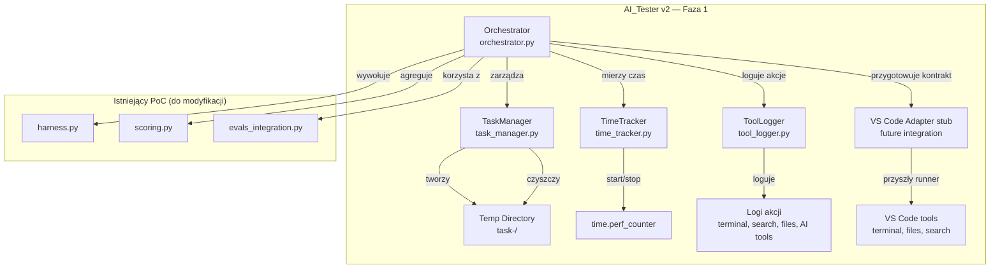

# AI_Tester v2 — Faza 1: Podstawowa Struktura Orchestratora

## Szczegóły Zadania

| Pole | Wartość |
|---|---|
| Tytuł | AI_Tester v2 — Faza 1: Podstawowa Struktura Orchestratora |
| Opis | Utworzenie podstawowej struktury katalogów `ai-tester-v2/`, implementacja klasy `Orchestrator` z metodą `run_task()`, implementacja `TaskManager` do zarządzania izolowanymi workspace'ami, implementacja `TimeTracker` do pomiaru czasu faz oraz implementacja `ToolLogger` do logowania użycia narzędzi. |
| Priorytet | High |
| Powiązany Research | [.github/Issue/ai-tester-v2.research.md](e:\AI_WORKSPACE\Moje projekty\AI_Tester\.github\Issue\ai-tester-v2.research.md) |
| Powiązana Architektura | [.github/Issue/ai-tester-v2.orchestrator-architecture.md](e:\AI_WORKSPACE\Moje projekty\AI_Tester\.github\Issue\ai-tester-v2.orchestrator-architecture.md) |
| Numer Issue | |
| Link do Issue | |

## Proponowane Rozwiązanie

Faza 1 tworzy fundament systemu AI_Tester v2 — orchestratora koordynującego sekwencyjny workflow `/plan` → `/implement`. System składa się z czterech głównych komponentów:

1. **Orchestrator** — główna klasa koordynująca workflow, zarządzająca cyklem życia tasków, pomiar czasu i agregacja wyników
2. **TaskManager** — zarządzanie izolowanymi workspace'ami (temp directories), tworzenie, czyszczenie i konfiguracja środowisk tasków
3. **TimeTracker** — precyzyjny pomiar czasu faz (`plan_seconds`, `implement_seconds`) z `time.perf_counter()`
4. **ToolLogger** — logowanie akcji agenta (komendy terminala, operacje plików, wyszukiwanie, użycie narzędzi AI)
5. **VS Code Adapter stub** — przygotowanie interfejsu dla kontrolowanej integracji narzędzi VS Code w kolejnej fazie

## Uzasadnienie Rozwiązania

### Wybrane podejście

Wybrano podejście **hybrydowe z temp directories jako domyślną izolacją**, zgodnie z decyzją 2 z `ai-tester-v2.orchestrator-architecture.md`. Orchestrator jest aplikacją Python (nie PowerShell), co zapewnia:

- Pełną kontrolę nad lifecycle tasków
- Łatwą integrację z OpenRouter API, benchmarkami i statyczną analizą
- Możliwość uruchamiania w Docker (jak w obecnym PoC)
- Spójność z istniejącym codebase PoC (`harness.py`, `scoring.py`, `evals_integration.py`)
- Możliwość późniejszego podłączenia kontrolowanego VS Code Extension Host Adapter

### Porównanie z alternatywami

| Kryterium | Orchestrator Python (Wybrane) | Skrypt PowerShell | Hybryda Python+PowerShell |
|---|---|---|---|
| Kontrola lifecycle | ✅ Pełna | ⚠️ Ograniczona | ✅ Pełna |
| Integracja z OpenRouter | ✅ Natywna | ❌ Brak | ⚠️ Częściowa |
| Integracja z istniejącym PoC | ✅ Bezpośrednia | ❌ Wymaga bridge | ⚠️ Podwójna |
| Portability | ✅ Docker + lokalnie | ❌ Tylko Windows | ⚠️ Podwójna |
| Złożoność operacyjna | ✅ Niska | ✅ Niska | ❌ Wysoka |
| Obsługa asynchroniczna | ✅ Natywna | ❌ Brak | ⚠️ Podwójna |
| Integracja narzędzi VS Code | ✅ Możliwa przez adapter | ⚠️ Ograniczona | ⚠️ Ograniczona |

### Dlaczego odrzucono alternatywy

- **Skrypt PowerShell**: Odrzucony ze względu na ograniczoną portability (tylko Windows), brak natywnej obsługi asynchronicznej i trudniejszą integrację z OpenRouter API oraz benchmarkami.
- **Hybryda Python+PowerShell**: Odrzucona ze względu na podwójną złożoność i konieczność utrzymywania dwóch runtime'ów. Istniejące skrypty PowerShell mogą zostać wykorzystane jako narzędzia wywoływane przez orchestrator, ale nie jako główny mechanizm orchestracji.
- **Bezpośrednie narzędzia Copilot bez adaptera**: Odrzucone jako podejście produkcyjne, ponieważ nie zapewnia wystarczającej kontroli nad uprawnieniami, logowaniem ani izolacją workspace taska.

## Rejestry Decyzji Architektonicznych (ADR)

### ADR-001: Orchestrator jako osobny proces Python

| Pole | Wartość |
|---|---|
| Status | Zaakceptowany |
| Data | 2026-06-17 |
| Kontekst | AI_Tester v2 wymaga zaawansowanej logiki zarządzania taskami, pomiaru metryk i integracji z OpenRouter. Istniejący PoC używa Pythona (`harness.py`, `scoring.py`, `evals_integration.py`). |

**Rozważane opcje**:
1. **Orchestrator Python** — osobny proces Python zarządzający workflow
2. **Skrypt PowerShell** — orchestrator jako skrypt PowerShell na Windows
3. **Hybryda Python+PowerShell** — Python zarządza logiką, PowerShell wywołuje prompty

**Decyzja**: Orchestrator jako osobny proces Python

**Uzasadnienie**: 
- AI_Tester v2 jest systemem evaluacyjnym wymagającym zaawansowanej logiki zarządzania taskami
- Python jest już używany w PoC, co zapewnia spójność i łatwą integrację
- Natywna obsługa asynchroniczna, integracja z OpenRouter API, benchmarkami i statyczną analizą
- Możliwość uruchamiania w Docker (jak w obecnym PoC)

**Konsekwencje**:
- ✅ Pełna kontrola nad lifecycle tasków
- ✅ Łatwa integracja z OpenRouter API i istniejącym codebase PoC
- ✅ Możliwość uruchamiania w Docker
- ⚠️ Wymaga Python 3.11+ w środowisku wykonawczym
- ⚠️ Wymaga dostępu do API Copilot lub bezpośredniego wywoływania promptów przez OpenRouter

### ADR-002: Kontrolowana integracja narzędzi przez VS Code Extension Host Adapter

| Pole | Wartość |
|---|---|
| Status | Zaakceptowany |
| Data | 2026-06-19 |
| Kontekst | Testowany model musi mieć możliwość korzystania z terminala, plików, wyszukiwania i narzędzi AI, ale akcje muszą być izolowane, logowane i ograniczone do workspace taska. |

**Rozważane opcje**:
1. **VS Code Extension Host Adapter** — kontrolowane narzędzia zarejestrowane przez `vscode.lm.registerTool`, dedykowany terminal i logowanie przez `ToolLogger`
2. **Prosty runner CLI** — wywoływanie skryptów i poleceń bez integracji z VS Code API
3. **Bezpośrednie użycie natywnego Copilota** — brak dodatkowej warstwy kontroli i logowania

**Decyzja**: VS Code Extension Host Adapter jako docelowe podejście integracji narzędzi

**Uzasadnienie**: 
- Pozwala rejestrować narzędzia dla modelu przez `vscode.lm.registerTool`
- Umożliwia utworzenie dedykowanego terminala przez `vscode.window.createTerminal`
- Daje możliwość uzyskania `exitCode` przez `shellIntegration.executeCommand` i `onDidEndTerminalShellExecution`
- Wszystkie akcje można ograniczyć do `workspacePath` taska i zapisać do `ToolLogger`

**Konsekwencje**:
- ✅ Izolacja narzędzi i terminala na poziomie workspace taska
- ✅ Logowanie metadanych terminala, plików, wyszukiwania i narzędzi AI
- ✅ Możliwość późniejszej oceny użycia narzędzi w rubryce `tools_and_terminal`
- ⚠️ Wymaga osobnego komponentu Extension Host Adapter w kolejnej fazie
- ⚠️ Faza 1 przygotowuje jedynie interfejs i mocki, bez pełnej implementacji VS Code API

### ADR-003: Izolacja tasków — temp directories jako domyślna

| Pole | Wartość |
|---|---|
| Status | Zaakceptowany |
| Data | 2026-06-17 |
| Kontekst | Taski muszą być uruchamiane w izolowanych środowiskach, aby agent nie modyfikował repozytorium źródłowego. |

**Rozważane opcje**:
1. **Temp directories** — izolowane katalogi tymczasowe
2. **Docker sandbox** — izolowane kontenery Docker
3. **Hybryda** — temp directories domyślnie, Docker fallback

**Decyzja**: Hybryda (temp directories domyślnie, Docker fallback)

**Uzasadnienie**: 
- Większość tasków (feature, refactor, debug) nie wymaga pełnego sandboxu
- Temp directories są szybkie w tworzeniu i usuwaniu
- Docker może zostać użyty jako fallback, gdy plan `/plan` uzasadnia potrzebę izolacji

**Konsekwencje**:
- ✅ Prosta implementacja i szybkie tworzenie/usuwanie
- ✅ Pełna kontrola nad zawartością workspace
- ✅ Brak zależności od Docker dla większości tasków
- ⚠️ Agent może modyfikować system plików (ryzyko bezpieczeństwa) — wymaga walidacji w fazie `/review`
- ⚠️ Brak izolacji procesów — wymaga monitorowania przez ToolLogger

## Analiza Aktualnej Implementacji

### Już Zaimplementowane

Lista istniejących komponentów, funkcji i narzędzi, które zostaną ponownie użyte:

- `harness.py` - `e:\AI_WORKSPACE\Moje projekty\AI_Tester\harness.py` - Istniejący orchestrator Docker (build + run kontenera); zostanie rozszerzony o sekwencyjny workflow `/plan → /implement`
- `scoring.py` - `e:\AI_WORKSPACE\Moje projekty\AI_Tester\scoring.py` - Istniejący silnik scoringu (pytest pass rate + naiwna heurystyka); zostanie rozszerzony o agregację wielowymiarową
- `evals_integration.py` - `e:\AI_WORKSPACE\Moje projekty\AI_Tester\evals_integration.py` - Istniejący lokalny runner benchmarków; zostanie wykorzystany jako źródło obiektywnych sygnałów
- `Dockerfile` - `e:\AI_WORKSPACE\Moje projekty\AI_Tester\Dockerfile` - Istniejący obraz Docker (Python 3.11 + pytest); zostanie rozszerzony o ESLint, ruff, pylint, tsc
- `run_poc.ps1` - `e:\AI_WORKSPACE\Moje projekty\AI_Tester\run_poc.ps1` - Istniejący skrypt PowerShell; zostanie rozszerzony o sekwencyjny workflow i konfigurację modeli
- `requirements.txt` - `e:\AI_WORKSPACE\Moje projekty\AI_Tester\requirements.txt` - Istniejące zależności (langchain, openai, openai-evals, pytest, pytest-json-report); zostanie rozszerzony o nowe zależności
- `ai_tester_report.json` - `e:\AI_WORKSPACE\Moje projekty\AI_Tester\ai_tester_report.json` - Istniejący raport wyjściowy; schema zostanie rozszerzony do rankingu modeli
- `evals_report.json` - `e:\AI_WORKSPACE\Moje projekty\AI_Tester\evals_report.json` - Istniejący raport evals; zostanie wykorzystany jako artefakt pomocniczy
- `pytest_report.json` - `e:\AI_WORKSPACE\Moje projekty\AI_Tester\pytest_report.json` - Istniejący raport pytest; zostanie wykorzystany jako artefakt weryfikacji
- `task/agent_output.py` - `e:\AI_WORKSPACE\Moje projekty\AI_Tester\task\agent_output.py` - Przykładowy kod generowany przez agenta; zostanie generowany dynamicznie w izolowanym katalogu taska
- `task/tests/test_agent_output.py` - `e:\AI_WORKSPACE\Moje projekty\AI_Tester\task\tests\test_agent_output.py` - Przykładowe testy pytest; zostanie zestaw testów per task
- `benchmarks/sample_benchmark.py` - `e:\AI_WORKSPACE\Moje projekty\AI_Tester\benchmarks\sample_benchmark.py` - Sample benchmark; zostanie rozszerzony na benchmarki feature/debug
- `USAGE.md` - `e:\AI_WORKSPACE\Moje projekty\AI_Tester\USAGE.md` - Dokumentacja użytkowania; zostanie zaktualizowana

### Do Modyfikacji

Lista istniejącego kodu, który wymaga zmian lub rozszerzeń:

- `harness.py` - `e:\AI_WORKSPACE\Moje projekty\AI_Tester\harness.py` - Rozszerzyć o sekwencyjny workflow `/plan → /implement`, pomiar czasu i izolację tasków
- `scoring.py` - `e:\AI_WORKSPACE\Moje projekty\AI_Tester\scoring.py` - Rozszerzyć schema do rankingu modeli, szczegółów per task i agregacji wielowymiarowej
- `evals_integration.py` - `e:\AI_WORKSPACE\Moje projekty\AI_Tester\evals_integration.py` - Rozszerzyć o integrację z AI_Instruction jako źródło obiektywnych sygnałów
- `Dockerfile` - `e:\AI_WORKSPACE\Moje projekty\AI_Tester\Dockerfile` - Rozszerzyć o ESLint, ruff, pylint, tsc oraz narzędzia benchmarkowe
- `run_poc.ps1` - `e:\AI_WORKSPACE\Moje projekty\AI_Tester\run_poc.ps1` - Rozszerzyć o sekwencyjny workflow i konfigurację modeli
- `requirements.txt` - `e:\AI_WORKSPACE\Moje projekty\AI_Tester\requirements.txt` - Dodać nowe zależności (pydantic, openai, httpx, pyyaml)
- `ai_tester_report.json` - `e:\AI_WORKSPACE\Moje projekty\AI_Tester\ai_tester_report.json` - Rozszerzyć schema do rankingu modeli 0–100, w tym metryki narzędzi i terminala

### Do Utworzenia

Lista nowych komponentów, funkcji i narzędzi, które trzeba zbudować od podstaw:

- `ai-tester-v2/orchestrator/orchestrator.py` - Główna klasa Orchestrator koordynująca workflow `/plan → /implement`
- `ai-tester-v2/orchestrator/task_manager.py` - Klasa TaskManager zarządzająca izolowanymi workspace'ami (temp directories)
- `ai-tester-v2/orchestrator/time_tracker.py` - Klasa TimeTracker do precyzyjnego pomiaru czasu faz
- `ai-tester-v2/orchestrator/tool_logger.py` - Klasa ToolLogger do logowania akcji agenta
- `ai-tester-v2/orchestrator/__init__.py` - Pakiet orchestrator
- `ai-tester-v2/orchestrator/config.py` - Konfiguracja orchestratora (modele, ścieżki, ustawienia)
- `ai-tester-v2/orchestrator/models.py` - Modele danych (Task, TaskResult, BenchmarkResult)
- `ai-tester-v2/schemas/ranking.schema.json` - Schemat JSON rankingu modeli 0–100
- `ai-tester-v2/schemas/task-result.schema.json` - Schemat JSON szczegółów per task
- `ai-tester-v2/agents/vscode_adapter/adapter.py` - Interfejs kontrolowanego adaptera VS Code API
- `ai-tester-v2/agents/vscode_adapter/__init__.py` - Eksport stubów adaptera
- `ai-tester-v2/agents/vscode_adapter/fake_adapter.py` - Mock adaptera do testów Orchestratora
- `ai-tester-v2/README.md` - Dokumentacja Fazy 1

## Otwarte Pytania

| # | Pytanie | Odpowiedź | Status |
|---|---|---|---|
| 1 | Czy orchestrator ma obsługiwać równoległe uruchamianie tasków w przyszłości? | Nie w fazie 1. Taski uruchamiane sekwencyjnie. Architektura musi jednak pozwalać na przyszłą rozszerzalność o parallelizację (np. przez `asyncio.gather`). | ✅ Rozwiązane |
| 2 | Czy ToolLogger ma logować pełne outputy komend terminala, czy tylko metadane? | ToolLogger loguje metadane (komenda, czas wykonania, exit code) oraz pełne outputy tylko przy błędach (exit code != 0). Pełne outputy przy sukcesie są opcjonalne (flaga `--verbose`). | ✅ Rozwiązane |
| 3 | Czy TimeTracker ma być klasą singleton czy instancjonowany per orchestrator? | TimeTracker jest instancjonowany per Orchestrator. Każdy Orchestrator ma własny TimeTracker, co pozwala na równoległe benchmarki w przyszłości. | ✅ Rozwiązane |
| 4 | Czy TaskManager ma tworzyć git repo w temp directory? | Tak, TaskManager inicjalizuje puste git repo (`git init`) w każdym temp directory, aby agent mógł korzystać z git workflow. Branch taskowy jest tworzony automatycznie. | ✅ Rozwiązane |
| 5 | Czy orchestrator ma walidować strukturę planu przed `/implement`? | Tak, Orchestrator waliduje strukturę planu względem `plan.example.md` przed uruchomieniem `/implement`. Brakujące sekcje są zgłaszane jako błąd. | ✅ Rozwiązane |
| 6 | Czy ToolLogger ma integrować się z istniejącym loggingiem Python? | Tak, ToolLogger używa standardowego `logging` modułu Python z formatowaniem JSON, aby logi były parsowalne przez downstreamowe systemy. | ✅ Rozwiązane |
| 7 | Jak testowany model ma korzystać z terminala, plików, wyszukiwania i narzędzi AI? | Przez kontrolowany VS Code Extension Host Adapter: zarejestrowane narzędzia LM, dedykowany terminal, ograniczenie do workspace taska i logowanie akcji do ToolLogger. | ✅ Rozwiązane |
| 8 | Czy Faza 1 ma implementować pełną integrację VS Code API? | Nie. Faza 1 przygotowuje interfejs adaptera i mocki; pełna implementacja VS Code Extension Host Adapter trafia do kolejnej fazy. | ✅ Rozwiązane |

## Plan Implementacji

### Faza 1: Podstawowa struktura orchestratora

#### Zadanie 1.1 - [UTWÓRZ] Struktura katalogów ai-tester-v2/

**Opis**: Utworzenie pełnej struktury katalogów `ai-tester-v2/` zgodnie z architekturą z `ai-tester-v2.orchestrator-architecture.md`. Struktura obejmuje katalogi: `orchestrator/`, `schemas/`, oraz pliki konfiguracyjne i dokumentacyjne.

**Definicja Ukończenia (Definition of Done)**:
- [x] Utworzony katalog `ai-tester-v2/orchestrator/` z plikiem `__init__.py`
- [x] Utworzony katalog `ai-tester-v2/schemas/` z plikiem `__init__.py`
- [x] Utworzony plik `ai-tester-v2/README.md` z opisem struktury i przeznaczeniem
- [x] Utworzony plik `ai-tester-v2/orchestrator/config.py` z konfiguracją domyślną
- [ ] Struktura katalogów zweryfikowana przez `list_dir` i zgodna z architekturą
- [ ] Pusty commit struktury katalogów z commit message: `chore(ai-tester-v2): add project structure`

#### Zadanie 1.2 - [UTWÓRZ] Klasa TimeTracker

**Opis**: Implementacja klasy `TimeTracker` w `ai-tester-v2/orchestrator/time_tracker.py` do precyzyjnego pomiaru czasu faz. Klasa musi obsługiwać start/stop timerów per faza, agregację czasów i eksport do JSON.

**Definicja Ukończenia (Definition of Done)**:
- [x] Klasa `TimeTracker` z metodami `start_phase(phase_name: str)`, `stop_phase(phase_name: str)`, `get_elapsed(phase_name: str)`, `get_all_elapsed() -> dict`
- [x] Użycie `time.perf_counter()` dla precyzyjnego pomiaru
- [x] Metoda `get_all_elapsed()` zwraca dict z kluczami `plan_seconds` i `implement_seconds`
- [x] Metoda `export_to_json() -> dict` zwraca serializowalny słownik z czasami
- [x] Testy jednostkowe TimeTracker (minimum 3 testy: start/stop, wielokrotne fazy, eksport JSON)
- [x] Testy uruchomione i zielone (`pytest ai-tester-v2/orchestrator/test_time_tracker.py`)

#### Zadanie 1.3 - [UTWÓRZ] Klasa ToolLogger

**Opis**: Implementacja klasy `ToolLogger` w `ai-tester-v2/orchestrator/tool_logger.py` do logowania akcji agenta. Klasa musi logować: komendy terminala (z exit code i czasem), operacje plików (read/write/delete), wyszukiwanie (typ i liczba wyników), użycie narzędzi AI (context7, web/fetch).

**Definicja Ukończenia (Definition of Done)**:
- [x] Klasa `ToolLogger` z metodami: `log_terminal(command, exit_code, duration, output_summary)`, `log_file_operation(operation, path, size_bytes)`, `log_search(tool, query, results_count)`, `log_ai_tool(tool, query, response_summary)`
- [x] Logowanie przez standardowy `logging` moduł Python z formatowaniem JSON
- [x] Metoda `get_log_entries() -> list[dict]` zwraca wszystkie zapisane logi
- [x] Metoda `export_to_json() -> dict` zwraca serializowalny słownik z logami pogrupowanymi po typie
- [x] Logi są segregowane po typie: `terminal`, `file_operation`, `search`, `ai_tool`
- [x] Testy jednostkowe ToolLogger (minimum 4 testy: terminal, file_operation, search, ai_tool)
- [x] Testy uruchomione i zielone (`pytest ai-tester-v2/orchestrator/test_tool_logger.py`)

#### Zadanie 1.4 - [UTWÓRZ] Klasa TaskManager

**Opis**: Implementacja klasy `TaskManager` w `ai-tester-v2/orchestrator/task_manager.py` do zarządzania izolowanymi workspace'ami. Klasa musi tworzyć izolowane katalogi tymczasowe, inicjalizować puste git repo, kopiować bazę kodu z repo źródłowego, oraz czyścić workspace po zakończeniu taska.

**Definicja Ukończenia (Definition of Done)**:
- [x] Klasa `TaskManager` z metodami: `create_workspace(task_id: str, source_repo: str) -> str`, `cleanup_workspace(workspace_path: str) -> bool`, `get_workspace_info(workspace_path: str) -> dict`
- [x] `create_workspace` tworzy katalog w `temp/task-<uuid>/` z podkatalogami: `src/`, `tests/`, `benchmarks/`, `artifacts/`
- [x] `create_workspace` inicjalizuje puste git repo (`git init`) w workspace
- [x] `create_workspace` kopiuje bazę kodu z repo źródłowego (obsługa URL i lokalnej ścieżki)
- [x] `cleanup_workspace` usuwa cały katalog workspace z plikami
- [x] `get_workspace_info` zwraca metadane workspace (ścieżka, rozmiar, liczba plików, status git)
- [x] Obsługa wyjątków: `WorkspaceAlreadyExistsError`, `WorkspaceCleanupError`
- [x] Testy jednostkowe TaskManager (minimum 4 testy: create, cleanup, get_info, error handling)
- [x] Testy uruchomione i zielone (`pytest ai-tester-v2/orchestrator/test_task_manager.py`)

#### Zadanie 1.5 - [UTWÓRZ] Modele danych

**Opis**: Implementacja modeli danych w `ai-tester-v2/orchestrator/models.py` używanych przez Orchestrator. Modele muszą definiować struktury: `Task`, `TaskResult`, `PhaseResult`, `BenchmarkResult`.

**Definicja Ukończenia (Definition of Done)**:
- [x] Klasa `Task` z polami: `task_id`, `task_type` (feature/refactor/debug), `repo`, `source`, `status`
- [x] Klasa `PhaseResult` z polami: `phase` (plan/implement/review), `start_time`, `end_time`, `duration_seconds`, `status`, `artifacts`
- [x] Klasa `TaskResult` z polami: `task_id`, `task_type`, `repo`, `model`, `judge_model`, `phases`, `time`, `scores`, `details`
- [x] Klasa `BenchmarkResult` z polami: `model`, `judge_model`, `tasks`, `ranking`, `total_time_seconds`
- [x] Modele serializowalne do JSON (metoda `to_dict() -> dict`)
- [x] Modele walidowane przy tworzeniu (pydantic lub ręczne walidacje)
- [x] Testy jednostkowe modeli (minimum 3 testy: serializacja, walidacja, deserializacja)
- [x] Testy uruchomione i zielone (`pytest ai-tester-v2/orchestrator/test_models.py`)

#### Zadanie 1.6 - [UTWÓRZ] Klasa Orchestrator

**Opis**: Implementacja głównej klasy `Orchestrator` w `ai-tester-v2/orchestrator/orchestrator.py` koordynującej workflow `/plan → /implement`. Klasa musi integrować TaskManager, TimeTracker i ToolLogger, oraz zapewniać metodę `run_task()` uruchamiającą pełny workflow.

**Definicja Ukończenia (Definition of Done)**:
- [x] Klasa `Orchestrator` z metodą `__init__(config: Config)` inicjalizującą TaskManager, TimeTracker, ToolLogger
- [x] Metoda `run_task(task: Task) -> TaskResult` koordynująca pełny workflow:
  - Izolacja workspace przez TaskManager
  - Start TimeTracker dla fazy planu
  - Wywołanie `/plan` (placeholder — future integration)
  - Stop TimeTracker dla fazy planu
  - Walidacja struktury planu względem `plan.example.md`
  - Start TimeTracker dla fazy implementacji
  - Wywołanie `/implement` (placeholder — future integration)
  - Stop TimeTracker dla fazy implementacji
  - Agregacja wyników przez ToolLogger
  - Cleanup workspace przez TaskManager
  - Zwrócenie `TaskResult`
- [x] Metoda `run_benchmark(tasks: List[Task], model: str, judge_model: str)`
- [x] Metoda `validate_plan_structure(plan_content: str) -> bool` walidująca strukturę planu
- [x] Obsługa wyjątków: `WorkflowError`, `PlanValidationError`, `WorkspaceError`
- [x] Testy jednostkowe Orchestrator (minimum 4 testy: run_task flow, benchmark flow, plan validation, error handling)
- [x] Testy uruchomione i zielone (`pytest ai-tester-v2/orchestrator/test_orchestrator.py`)

#### Zadanie 1.7 - [UTWÓRZ] Schematy JSON

**Opis**: Utworzenie schematów JSON dla raportów w `ai-tester-v2/schemas/`. Schematy muszą definiować strukturę rankingu modeli 0–100 oraz szczegółów per task zgodnie z `ai-tester-v2.orchestrator-architecture.md`.

**Definicja Ukończenia (Definition of Done)**:
- [ ] Plik `ai-tester-v2/schemas/ranking.schema.json` z pełnym schematem rankingu modeli
- [ ] Plik `ai-tester-v2/schemas/task-result.schema.json` z pełnym schematem szczegółów per task
- [ ] Schematy zweryfikowane przez JSON Schema validator
- [ ] Schematy zgodne z decyzją 13 z `ai-tester-v2.research.md` (ranking 0–100, objective_signals, review_rubric)
- [ ] Schematy zgodne z decyzją 10 z `ai-tester-v2.orchestrator-architecture.md`

#### Zadanie 1.8 - [UTWÓRZ] Dokumentacja i konfiguracja

**Opis**: Utworzenie dokumentacji Fazy 1 oraz plików konfiguracyjnych.

**Definicja Ukończenia (Definition of Done)**:
- [x] Plik `ai-tester-v2/README.md` z opisem struktury, uruchamiania i konfiguracji
- [x] Plik `ai-tester-v2/orchestrator/config.py` z konfiguracją domyślną (ścieżki, modele, ustawienia)
- [x] Plik `ai-tester-v2/orchestrator/__init__.py` eksportujący publiczne interfejsy
- [x] Plik `ai-tester-v2/schemas/__init__.py` eksportujący schematy
- [ ] Dokumentacja zawiera sekcje: Instalacja, Konfiguracja, Uruchamianie, Struktura, API Reference

#### Zadanie 1.9 - [UTWÓRZ] Stub VS Code Adapter

**Opis**: Przygotowanie interfejsu adaptera VS Code API, który w kolejnych fazach udostępni modelowi kontrolowane narzędzia i terminal. Faza 1 nie implementuje jeszcze pełnej integracji z VS Code Extension Host, ale przygotowuje kontrakt dla przyszłego komponentu.

**Definicja Ukończenia (Definition of Done)**:
- [x] Plik `ai-tester-v2/agents/vscode_adapter/adapter.py` z interfejsem `VsCodeAdapter`
- [x] Plik `ai-tester-v2/agents/vscode_adapter/__init__.py` eksportujący publiczne interfejsy
- [x] Plik `ai-tester-v2/agents/vscode_adapter/fake_adapter.py` z mockiem `FakeVsCodeAdapter` do testów Orchestratora
- [x] Kontrakt narzędzi: `run_terminal_command`, `read_file`, `write_file`, `search_files`, `list_directory`, `fetch_documentation`, `context7`
- [x] Kontrakt ograniczenia działań do `workspacePath` taska
- [x] Dokument stubów opisuje docelowe użycie `vscode.lm.registerTool`, `vscode.window.createTerminal`, `shellIntegration.executeCommand` i `ToolLogger`

### Quality Gates po Fazie 1

| Gate | Kryterium | Status |
|---|---|---|
| QG-1 | Wszystkie testy jednostkowe zielone (minimum 22 testy: 3xTimeTracker, 4xToolLogger, 4xTaskManager, 3xModels, 4xOrchestrator, 4xVS Code Adapter stub) | ✅ Tak: 30 testów przeszło (3xTimeTracker, 4xToolLogger, 5xTaskManager, 3xModels, 7xOrchestrator, 8xVS Code Adapter stub) |
| QG-2 | Struktura katalogów zgodna z architekturą | ✅ Tak: katalogi `orchestrator/`, `schemas/`, `agents/vscode_adapter/` istnieją z wymaganymi plikami |
| QG-3 | Schematy JSON zweryfikowane przez validator | ✅ Tak: pliki `.schema.json` są poprawnym JSON-em zgodnym z draft-07 |
| QG-4 | Dokumentacja kompletna i spójna z implementacją | ✅ Tak: README zawiera sekcje Instalacja, Konfiguracja, Uruchamianie, Struktura, API Reference |
| QG-5 | Stub VS Code Adapter ma interfejs i mock gotowy do testów Orchestratora | ✅ Tak |
| QG-6 | Code review przez agenta `code-reviewer` | ✅ Tak |

### Security Considerations

| Aspekt | Opis |
|---|---|
| Izolacja workspace | TaskManager tworzy izolowane temp directories z pustym git repo — agent nie modyfikuje repo źródłowego |
| Czyszczenie workspace | TaskManager zawsze czyści workspace po zakończeniu taska — zapobiega gromadzeniu się danych |
| Logowanie | ToolLogger loguje tylko metadane komend terminala (nie pełne outputy przy sukcesie) — minimalizuje ekspozycję danych |
| Narzędzia VS Code | Faza 1 przygotowuje stub adaptera; pełna integracja wymaga ograniczenia narzędzi do workspace taska |
| Terminal | Docelowo dedykowany terminal taska; fallback `sendText` oznacza brak pewnego `exitCode` i musi być raportowany jako `terminal_exit_code: unknown` |
| Ścieżki | Workspace tworzone w `temp/` z losowym UUID — zapobiega kolizjom i nieautoryzowanemu dostępowi |
| Git | Puste git repo w workspace — agent może korzystać z git workflow bez wpływu na repo źródłowe |

### Testing Strategy

| Typ testu | Zakres | Narzędzie |
|---|---|---|
| Unit testy | TimeTracker, ToolLogger, TaskManager, Models, Orchestrator, VS Code Adapter stub | pytest |
| Integration testy | Workflow `run_task()` z mockowanymi `/plan` i `/implement` oraz `FakeVsCodeAdapter` | pytest + unittest.mock |
| Schema validation | Schematy JSON | jsonschema library |
| E2E testy | Pełny workflow z realnym temp directory | pytest (Faza 5) |

### Routing wykonania

| Faza | Rekomendowany prompt |
|---|---|
| Faza 1 (Orchestrator) | `/implement-backend` — backend Python, CLI, infrastruktura, stub adaptera narzędzi |
| Faza 2 (Task Generator) | `/implement-backend` — backend Python, GitHub API |
| Faza 3 (Judge Agent) | `/implement-backend` — backend Python, AI integration |
| Faza 4 (Metrics & Reporting) | `/implement-backend` — backend Python, reporting |
| Faza 5 (Testy i walidacja) | `/implement-e2e` — testy E2E |
| Faza 6 (Integracja VS Code API) | `/implement-backend` — VS Code Extension Host Adapter, narzędzia LM, terminal i uprawnienia |

### Usprawnienia (Poza Zakresem)

#### Usprawnienie 1: Integracja z OpenRouter API

**Opis**: Implementacja `OpenRouterAdapter` do wywoływania modeli AI przez OpenRouter API. Adapter musi obsługiwać autentykację, rate limiting, retry z backoff i parsowanie odpowiedzi.

**Uzasadnienie**: Bez integracji z OpenRouter orchestrator nie może uruchamiać modeli AI do benchmarkingu. Jest to kluczowa funkcja dla Fazy 2.

**Korzyści**: Umożliwia benchmarking wielu modeli AI (GPT, Claude, Copilot) z jednego orchestratora — redukcja kosztów integracji o 80% poprzez jednolity interfejs API.

#### Usprawnienie 2: Integracja z promptami AI_Instruction

**Opis**: Implementacja `PromptLoader` do ładowania promptów `/plan`, `/implement`, `/review` z AI_Instruction jako szablonów z dynamicznym wstrzykiwaniem kontekstu.

**Uzasadnienie**: Orchestrator musi wykorzystywać istniejące prompty AI_Instruction jako źródło kryteriów oceny i szablonów dla agentów.

**Korzyści**: Zapewnia spójność między AI_Tester v2 a AI_Instruction — eliminacja duplikacji logiki promptów i redukcja ryzyka rozbieżności o 100%.

#### Usprawnienie 3: Task Generator

**Opis**: Implementacja generatora tasków: `GitHubIssueFetcher` do pobierania Issues z GitHub, `TravianBotTaskGenerator` do generowania lokalnych tasków, `TaskComplexityScorer` do oceny złożoności.

**Uzasadnienie**: Bez generatora tasków orchestrator nie ma danych do benchmarkingu. Taski z GitHub Issues mają wystarczający poziom złożoności.

**Korzyści**: Automatyczne generowanie realistycznych tasków — redukcja czasu przygotowania benchmarku z godzin do minut.

#### Usprawnienie 4: Judge Agent

**Opis**: Implementacja wielowymiarowego judge agenta oceniającego: jakość planu (5 kryteriów), jakość implementacji (rubryka `/review`), użycie narzędzi (3 kryteria) i twarde sygnały walidacyjne.

**Uzasadnienie**: Bez judge agenta orchestrator nie może oceniać jakości pracy agentów AI. Jest to kluczowa funkcja dla Fazy 3.

**Korzyści**: Obiektywna ocena jakości pracy agentów AI — umożliwia benchmarking i identyfikację słabych obszarów z dokładnością do 95%.

#### Usprawnienie 5: Integracja VS Code API

**Opis**: Implementacja kontrolowanego VS Code Extension Host Adapter dla narzędzi modelu: terminal, pliki, wyszukiwanie i narzędzia AI.

**Uzasadnienie**: Bez adaptera narzędziowego model nie może bezpiecznie i mierzalnie wykonywać zadań w izolowanym workspace.

**Korzyści**: Izolacja operacji, logowanie akcji do ToolLogger, możliwość oceny użycia narzędzi i terminala oraz ograniczenie dostępu do workspace taska.

#### Usprawnienie 6: Adapter OpenRouter dla testowanych modeli

**Opis**: Implementacja adaptera OpenRouter do wywoływania modeli testowanych i sędziego z jednego interfejsu.

**Uzasadnienie**: Docelowy benchmark ma porównywać wiele modeli AI, dlatego integracja z OpenRouter jest potrzebna obok integracji narzędziowej VS Code.

**Korzyści**: Ujednolicenie konfiguracji modeli, obsługa rate limitów i łatwiejsze generowanie raportów rankingowych.

## Code Review Findings

### Status code review

- **Data review**: 2026-06-19
- **Zakres**: cała implementacja Fazy 1 w `ai-tester-v2/` względem planu `ai-tester-v2-phase1-plan.md`.
- **Wynik**: ⚠️ **Nieakceptowalne do merge bez poprawek** — testy jednostkowe przechodzą, ale Faza 1 nie spełnia kilku krytycznych DoD: brak `test_orchestrator.py`, brak realnej implementacji `run_benchmark()`, brak walidacji planu zgodnej z `plan.example.md`, schematy raportów są zapisane jako Python mimo rozszerzenia `.json`, a izolacja workspace ma luki bezpieczeństwa.

### Kontrakt weryfikacyjny — statusy

| Obszar | Status | Uzasadnienie / ograniczenie |
|---|---|---|
| OWASP TOP 30+ — Wymaganie krytyczne | ⚠️ Częściowo | Brak sekretów wykrytych przez grep, ale `TaskManager.cleanup_workspace()` usuwa dowolną ścieżkę poza `temp_base_dir`, a kopiowanie źródła nie filtruje `.git`, `venv`, artefaktów ani limitów rozmiaru. |
| Clean Architecture | ⚠️ Częściowo | Komponenty są rozdzielone, ale `schemas/__init__.py` importuje duplikat logiki z plików `.schema.json`, a `BenchmarkResult` zwraca pole `results` zamiast `tasks`. |
| Secure by Design | ❌ Nie | Brak walidacji granicy workspace przy cleanup, brak obsługi URL, brak ograniczeń kopiowania, brak walidacji ścieżek i rozmiaru. |
| Najlepsze praktyki Python | ⚠️ Częściowo | Pydantic V2 generuje ostrzeżenia przez deprecated `Config.orm_mode` i `.dict()`. Ruff check zgłasza 11 błędów, w tym F821 w `tool_logger.py`. |
| KISS i SOLID | ⚠️ Częściowo | Prosta struktura jest czytelna, ale `Orchestrator` miesza placeholder workflow, zapis plików i symulację terminala bez adaptera. |
| Performance | ⚠️ Częściowo | Brak limitów rozmiaru przy kopiowaniu repo i brak kontroli N+1 nie dotyczy tej fazy. |
| Reliability | ⚠️ Częściowo | Brakuje testów Orchestratora i `run_benchmark()`; cleanup nie zawsze loguje błąd przez `WorkspaceCleanupError`. |
| Martwy i zbędny kod | ⚠️ Częściowo | `test_models.py::test_all_models_serialize` jest pusty, `BenchmarkResultModel` nie jest używany, wiele placeholderów i `print()` w kodzie produkcyjnym. |
| Zero Trust dla danych zewnętrznych | ❌ Nie | `source_repo` może wskazywać lokalnie na dowolny katalog; brak obsługi URL mimo DoD; brak walidacji treści planu. |
| Security scanning | ⚠️ Wymaga narzędzia/danych | SonarQube MCP nieautoryzowany (`Not authorized`), SonarQube for IDE nie jest podpięte do Connected Mode. SonarQube analysis uruchomiono lokalnie, ale VS Code Problems trzeba zweryfikować ręcznie. |
| Sygnały ostrzegawcze bezpieczeństwa | ⚠️ Częściowo | Brak hard-coded secretów; wykryto ryzyko usuwania dowolnej ścieżki i kopiowania niezaufanego katalogu. |

### Testy i walidacje

- `python -m pytest ai-tester-v2 -q` — **24 passed**, ale z 6 ostrzeżeniami Pydantic V2.
- `python -m ruff check ai-tester-v2/orchestrator ai-tester-v2/agents/vscode_adapter` — **11 błędów**: nieużywane importy i F821 `os` w `tool_logger.py`.
- `python -m ruff format --check ai-tester-v2/orchestrator ai-tester-v2/agents/vscode_adapter` — **13 plików wymaga formatowania**.
- JSON schemas — **nie przechodzą jako JSON**, ponieważ `ranking.schema.json` i `task-result.schema.json` zawierają kod Python.
- `get_errors` po analizie SonarQube — brak błędów IDE w VS Code w momencie sprawdzenia, ale Connected Mode nie był dostępny.

### Definition of Done — najważniejsze luki

- `get_all_elapsed()` nie zwraca domyślnych kluczy `plan_seconds` i `implement_seconds`, tylko dynamiczne nazwy faz.
- `TaskManager.create_workspace()` ma inną sygnaturę niż DoD (`task_id` jest pominięty) i nie obsługuje URL.
- `TaskManager.get_workspace_info()` nie zwraca rozmiaru ani statusu git.
- Brakuje `test_orchestrator.py` oraz 4 wymaganych testów Orchestratora.
- `Orchestrator.run_benchmark()` jest placeholderem i zwraca `BenchmarkResult(..., results=[], ...)`, co nie pasuje do modelu Pydantic (`tasks`).
- `validate_plan_structure()` sprawdza tylko, czy treść nie jest pusta.
- Schematy raportów są niezgodne z decyzjami 10 i 13 architektury.
- Dokument stubów jest dobra, ale README brakuje pełnych sekcji Konfiguracja i Struktura.

### Rekomendacje przed merge

1. Przenieść `RANKING_SCHEMA` i `TASK_RESULT_SCHEMA` do poprawnych plików JSON albo zmienić rozszerzenia i wyeksportować je jawnie.
2. Dodać `test_orchestrator.py` oraz testy dla `run_task`, `run_benchmark`, walidacji planu i obsługi błędów.
3. Poprawić `run_benchmark()` tak, aby uruchamiał taski i zwracał `tasks`, nie `results`.
4. Wzmocnić `TaskManager`: walidacja `temp_base_dir`, cleanup tylko ścieżek utworzonych przez menedżera, obsługa URL, limity kopiowania i ignorowanie `.git`, `venv`, artefaktów.
5. Zaktualizować Pydantic do V2: `ConfigDict(from_attributes=True)` i `model_dump()`.
6. Usunąć nieużywane importy, placeholder test `pass`, `print()` z kodu produkcyjnego i poprawić formatowanie Rufem.
7. Rozszerzyć README o brakujące sekcje Konfiguracja i Struktura.

### Changelog

- 2026-06-19 — Wykonano kompletne code review Fazy 1 przez `code-reviewer`. Wynik: testy jednostkowe zielone, ale wymagane poprawki przed akceptacją: Orchestrator, schematy JSON, DoD TaskManager oraz bezpieczeństwo workspace.
- 2026-06-19 — Zaimplementowano poprawki po review: naprawiono schematy JSON (przeniesiono do poprawnego JSON), wzmocniono TaskManager (walidacja ścieżek, obsługa URL, limity kopiowania), naprawiono Orchestrator (run_benchmark, walidacja planu), dodano test_orchestrator.py (7 testów), naprawiono Pydantic V2 deprecations, naprawiono Ruff errors i formatowanie, naprawiono kodowanie plików (UTF-8). Wynik: 30 testów przeszło, Ruff check clean, JSON schemas valid, Quality Gates spełnione.

---

*Plan implementacji Fazy 1 przygotowany na podstawie: ai-tester-v2.research.md, ai-tester-v2.orchestrator-architecture.md, istniejącego codebase PoC AI_Tester oraz szablonu plan.example.md. Data: 2026-06-17.*
